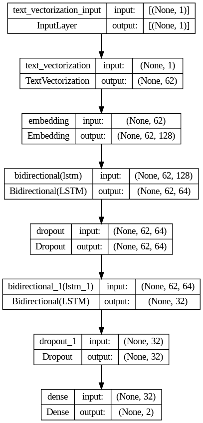
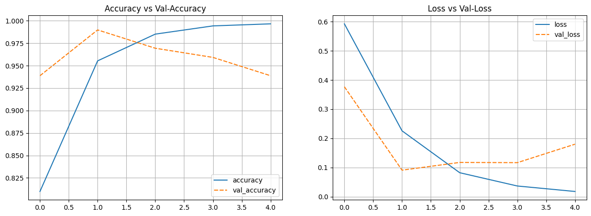
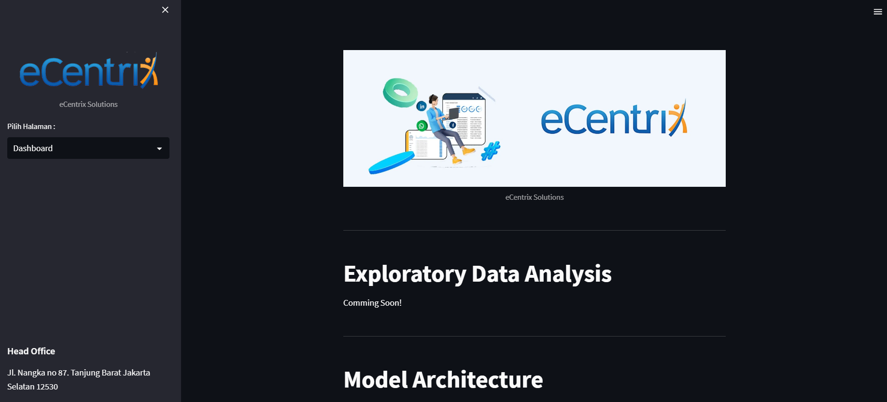
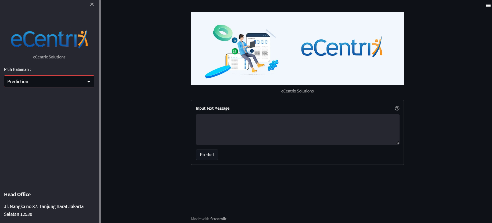

# MessageAlert
Deep Learning Text Classification Using LSTM for Spam Detection with Keras and TensorFlow
### *Requirements :*
- Keras
- Tensorflow
- Python 3.7
### *Model Architecture :*

    

### *Plot Training Result :*

    

### *UI Dashboard Interface :*

    

### *UI Prediction Interface :*

    

 
